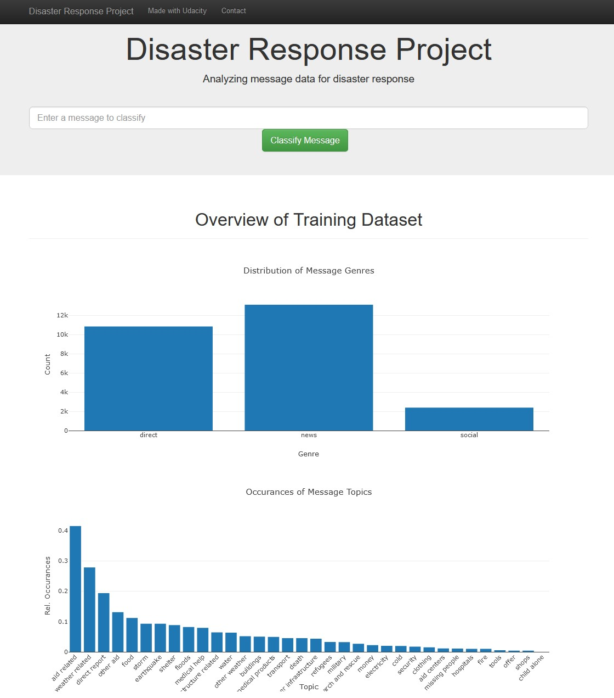

# Disaster Response Pipeline Project
## Motivation
This project includes a web app where an emergency worker can input a new message and get classification results in several categories. The web app also displays visualizations of the data.  

### Instructions:
1. Run the following commands in the project's root directory to set up your database and model. To run ETL pipeline that cleans data and stores in database  
`python data/process_data.py data/disaster_messages.csv data/disaster_categories.csv data/DisasterResponse.db`
To run ML pipeline that trains classifier and saves  
`python models/train_classifier.py data/DisasterResponse.db models/classifier.pkl`
2. Run the following command in the app's directory to run your web app.  
`python run.py`
3. Go to http://127.0.0.1:5000/index  

### Acknowledgement
*	The data and the projects scope was thankfully provided by [Figure Eight](https://www.figure-eight.com)
*	This project was also provided and supervised by [Udacity](https://www.udacity.com/)